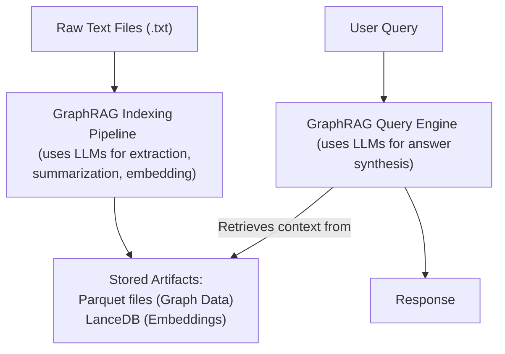

# Project Architecture

This document outlines the architecture of the GraphRAG project as demonstrated in this repository.

## Overview

GraphRAG (Graph Retrieval Augmented Generation) is a system designed to enhance Large Language Model (LLM) capabilities by leveraging knowledge graphs built from source data. This project provides a practical, runnable example of its core indexing and querying workflow.

The basic flow involves:
1.  **Ingesting** raw text data.
2.  **Indexing** this data by: 
    *   Chunking text into manageable units.
    *   Using LLMs to extract entities and relationships, forming a knowledge graph.
    *   Clustering entities into communities.
    *   Generating textual summaries for these communities and entities.
    *   Creating vector embeddings for text units, entity descriptions, and community summaries.
3.  **Storing** the processed graph, summaries, and embeddings (primarily in local Parquet files and LanceDB vector stores for this example).
4.  **Querying** the indexed data using various strategies (global, local) that leverage the graph structure and summaries to provide context to an LLM for answer generation.

## Core Components (as used in this example)

1.  **Data Ingestion**:
    *   **Source**: Local text files (e.g., `.txt`) placed in the `input/` directory.
    *   **Preparation**: GraphRAG internally handles reading and basic parsing of these files.

2.  **Indexing Pipeline (`graphrag index --root .`)**:
    *   **Text Extraction & Chunking**: Divides input documents into smaller `TextUnits`.
    *   **Graph Extraction**: Uses an LLM (configured in `settings.yaml` under `llm: type: <your_llm_type>`) to identify entities and relationships from text units. The prompts used are in the `prompts/` directory (e.g., `extract_graph.txt`).
    *   **Community Detection**: Applies algorithms (e.g., Leiden) to cluster nodes in the graph into communities.
    *   **Summarization**: Uses an LLM to generate textual summaries for extracted entities, relationships, and communities. Prompts like `summarize_descriptions.txt` and `community_report_text.txt` are used.
    *   **Embedding Generation**: Uses an LLM or a dedicated embedding model (configured in `settings.yaml` under `embeddings_llm: type: <your_embedding_model_type>`) to create vector embeddings for text units, entity descriptions, and community reports.

3.  **Storage (Local File System)**:
    *   **Knowledge Graph Data**: Entities, relationships, communities, text units, and document mappings are stored as Parquet files in the `output/` directory.
    *   **Vector Embeddings**: Stored in LanceDB format within the `output/lancedb/` directory.
    *   **Cache**: Intermediate results and LLM call history (if enabled) are stored in the `cache/` directory.
    *   **Logs**: Operational logs are written to the `logs/` directory.

4.  **Query Engine (`graphrag query --root . ...`)**:
    *   **Input**: User query string and a chosen query method (`global`, `local`, `drift`, `basic`).
    *   **Processing**: 
        *   For **global search**, uses community reports and their embeddings to find relevant high-level context.
        *   For **local search**, starts from entities relevant to the query and explores the graph locally.
    *   **LLM for Response Generation**: The retrieved context (summaries, graph snippets) is passed to an LLM (configured in `settings.yaml`) along with the original query to synthesize a final answer. Prompts like `global_search_reduce_system_prompt.txt` or `local_search_system_prompt.txt` guide the LLM.

## Data Flow Diagram (Conceptual)



## Technologies Used

*   **Python 3.11** (as per this setup)
*   **Microsoft GraphRAG library** (`graphrag` PyPI package)
*   **uv** (for environment and package management)
*   **LanceDB** (for local vector storage, bundled with GraphRAG)
*   **Apache Parquet** (for structured data storage, via PyArrow)
*   **LLM Providers**: Configurable via `settings.yaml`. Examples:
    *   OpenAI (e.g., GPT-4, GPT-3.5-turbo)
    *   Azure OpenAI
    *   OpenAI-compatible endpoints (for services like OpenRouter.ai, or local models via Ollama).

### Integrating with OpenRouter.ai or Ollama

GraphRAG can work with any OpenAI-compatible API endpoint. This allows usage of services like OpenRouter.ai (which aggregates many models) or local LLMs served by tools like Ollama.

**Key Configuration in `settings.yaml` (and `.env` for API keys):**

For each LLM task type in `settings.yaml` (e.g., `llm:`, `embeddings_llm:`, `community_reports_llm:`), you would set:

1.  **`type: openai`**: Even for non-OpenAI models, if the endpoint is OpenAI-compatible, this type is often used.
2.  **`api_base: "<your_endpoint_url>"`**: 
    *   For OpenRouter: e.g., `"https://openrouter.ai/api/v1"`
    *   For Ollama (default): e.g., `"http://localhost:11434/v1"`
3.  **`model: "<model_identifier>"`**: 
    *   For OpenRouter: The model string as specified by OpenRouter (e.g., `mistralai/mistral-7b-instruct`).
    *   For Ollama: The name of the model you have pulled and are serving (e.g., `nomic-embed-text`, `llama3`).
4.  **`api_key: "${YOUR_API_KEY_ENV_VAR}"`** (or the actual key if not using an env var):
    *   For OpenRouter: Your OpenRouter API key.
    *   For Ollama: Often can be a non-empty string like `"ollama"` or `"NA"`, as local Ollama doesn't typically require a true API key for its OpenAI-compatible endpoint.

**Example Snippet for `settings.yaml` using Ollama for embeddings:**
```yaml
# ... other settings ...
embeddings_llm:
  type: openai
  api_key: "ollama" # Or as required by your Ollama setup
  api_base: "http://localhost:11434/v1"
  model: "nomic-embed-text" # Ensure this model is served by your Ollama instance
  # Other parameters like max_tokens, temperature might also be configurable
# ... other settings ...
```

**Important Considerations:**
*   Ensure the chosen model is suitable for the task (e.g., an embedding model for `embeddings_llm`, an instruction-tuned model for general `llm` tasks).
*   Local models (Ollama) need to be downloaded and running before GraphRAG attempts to use them.
*   Performance (speed and quality) will vary significantly based on the model and hardware if running locally.

## Scalability and Performance

*   For this local example, scalability is limited by local machine resources (CPU, RAM, disk I/O).
*   LLM API calls can be a bottleneck; network latency and provider rate limits apply.
*   GraphRAG itself has parameters for batching and concurrency that can be tuned for larger datasets (see official documentation).
*   Using more powerful (and often more expensive) LLMs will generally yield better quality results but take longer or cost more.

## Security

*   **API Keys**: Handled via the `.env` file and referenced in `settings.yaml`. The `.env` file is gitignored.
*   **Local Data**: All generated data (`output/`, `cache/`) is stored locally. Ensure appropriate file system permissions.
*   **LLM Interactions**: Data is sent to external LLM providers as configured. Be mindful of data privacy policies of the chosen providers. 